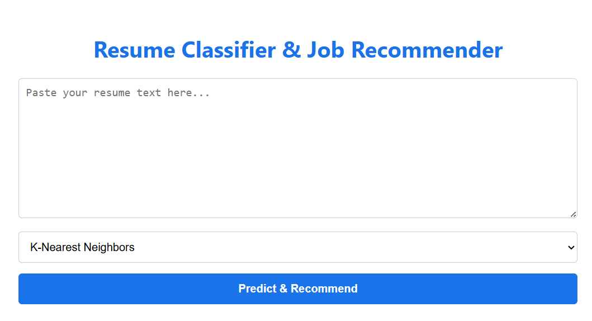

# AI-Powered Resume Sorter & Job Recommender

Ever felt overwhelmed by a mountain of resumes? This project is my answer to that problem. I've built an intelligent web application that automatically sorts resumes into the right job categories and even suggests other roles the candidate might be a great fit for.

---

## Live Demo & A Quick Look

Curious to see it in action? You can try out the live application right here:

**[https://huggingface.co/spaces/dushyant64/Resume-Classification-and-Job-recommendation](https://huggingface.co/spaces/dushyant64/Resume-Classification-and-Job-recommendation)**

Here’s a snapshot of what the app looks like:

---

## The Big Idea

The goal was simple: build a smart tool to make the first step of hiring—resume screening—faster and more accurate. I wanted to create something that could:
-   Automatically categorize any resume into one of 25 job roles.
-   Recommend other suitable jobs for a candidate.
-   Be easy enough for anyone to use through a simple web interface.

---

## How It's Built: From Raw Text to Smart Predictions

Here’s a peek into the journey from a simple resume file to a full-blown prediction and recommendation:

#### 1. The Foundation: The Dataset
This whole project started with the **"Resume Dataset,"** a collection of **962 real-world resumes**, each already sorted into one of 25 job categories. Before any magic could happen, I wrote a script to clean up the text—stripping out messy things like web links, special characters, and other noise.

#### 2. Teaching the Machine to Read
A computer can't understand words directly, so I had to turn the resumes into numbers. I used two main techniques for this:
-   **TF-IDF (Term Frequency-Inverse Document Frequency):** A classic method that figures out which words in a resume are most important.
-   **Tokenizer:** For my deep learning model, I converted sentences into sequences of numbers, which helps the model understand the order and context of words.

#### 3. The Brains of the Operation: The Models
I didn’t just build one model; I built three to see which one would do the best job. Each has a different way of "thinking":
-   **K-Nearest Neighbors (KNC):** A straightforward model that finds the "closest" matching resumes from the ones it's already seen.
-   **Multinomial Naive Bayes (MNB):** A smart probabilistic model that's great at handling text.
-   **Recurrent Neural Network (RNN) with LSTM:** A deep learning model that reads resumes like a human does—sequentially—allowing it to understand the context and flow of the text.

#### 4. The "What's Next?" Feature: Job Recommendations
After figuring out a candidate's primary job category, I wanted the app to suggest other roles they might be interested in. Using **Cosine Similarity**, the app calculates which job categories are most similar to the predicted one and recommends the top five alternatives.

---

## The Scoreboard: How Well Did the Models Perform?

After training, I tested the models on a set of resumes they had never seen before. The results were fantastic:

| Model | Test Accuracy |
| :--- | :--- |
| **K-Nearest Neighbors (KNC)** | 98.44% |
| **Multinomial Naive Bayes (MNB)** | 93.78% |
| **Recurrent Neural Network (RNN)**| 98.45% |

The RNN model came out on top, which makes sense as its architecture is designed to understand the nuances of language.

---

## The Toolbox: Libraries & Tech Used

This project wouldn't have been possible without these amazing tools:
-   **Flask:** For building the web app's backend.
-   **Scikit-learn:** The workhorse for the traditional machine learning models (TF-IDF, KNC, MNB, Cosine Similarity).
-   **TensorFlow & Keras:** For building and training the powerful RNN model.
-   **Pandas & NumPy:** For all the data handling and number-crunching.
-   **Gunicorn:** To run the Flask app in a production environment.
-   **Matplotlib & Seaborn:** For creating the charts and graphs during my initial data analysis.

---

## Final Thoughts & What’s Next

This project was a fantastic journey into solving a real-world problem with NLP and machine learning. The result is a fast, accurate, and scalable tool that could genuinely help streamline any company's hiring process.

Looking ahead, it would be exciting to expand the number of job categories, experiment with even more advanced models like BERT, and maybe even add a feature to match resumes directly to live job postings.

